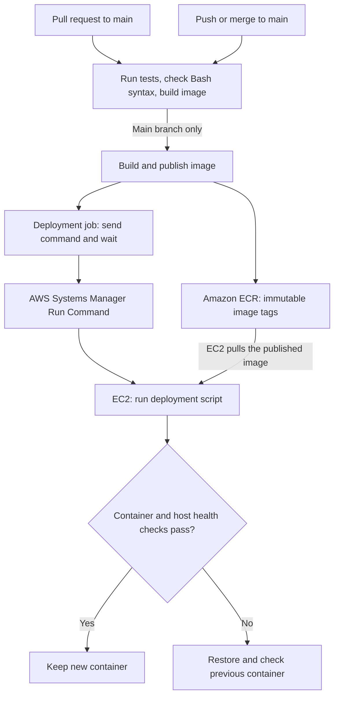
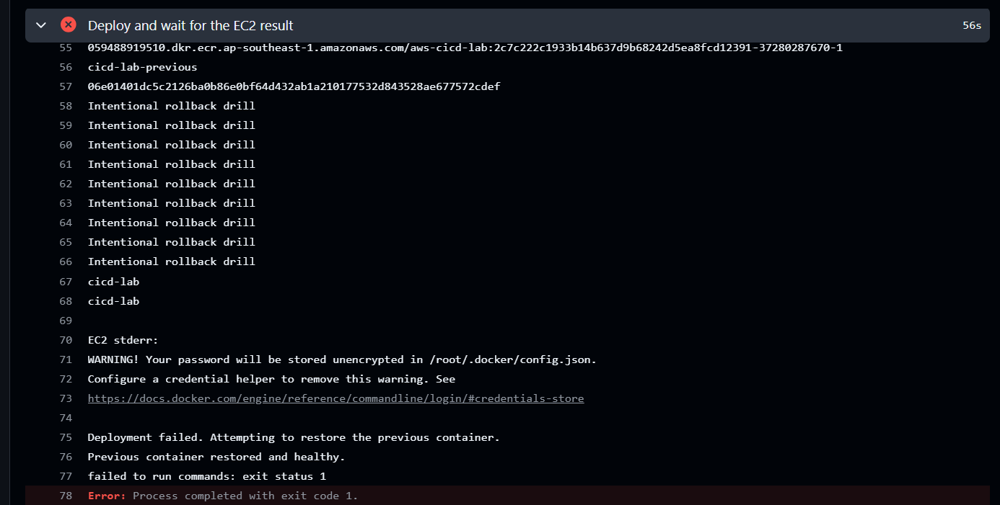

# AWS CI/CD Lab

[](https://github.com/yongkang863/aws-cicd-lab/actions/workflows/ci.yml)

A guided, hands-on learning project demonstrating how a Python application moves from a pull request to an AWS deployment. The pipeline tests the application, publishes a Docker image to Amazon ECR, and deploys it to EC2 through AWS Systems Manager. If the new container fails its health checks, the deployment script attempts to restore the previous container.

**Stack:** Python 3.12, Flask, Waitress, pytest, Docker, GitHub Actions, AWS IAM/OIDC, ECR, EC2, and Systems Manager.

## Architecture



GitHub Actions uses OIDC to obtain temporary AWS credentials through separate publishing and deployment roles. EC2 uses its own instance role to pull images and communicate with Systems Manager.

## What happens in the pipeline

| Stage | Trigger | Work performed |
| --- | --- | --- |
| Test and build | Pull request or push to `main` | Install dependencies, run pytest, check deployment script syntax, and build the Docker image. |
| Publish to ECR | Successful checks on a push to `main` | Build the image from that commit and push it with a unique tag. |
| Deploy to EC2 | Successful image publication | Pass the published image URI to Systems Manager, wait for the remote command, and report its result. |

Image tags use `<commit-sha>-<workflow-run-id>-<run-attempt>`. ECR tag immutability prevents overwriting an existing tag. The publishing job builds the image again on its own runner; it does not reuse the image built in the test job.

On EC2, the script pulls the image before stopping the existing container. It retains the old container until the replacement passes health checks, then removes the old container. A host lock prevents overlapping deployment scripts from changing containers simultaneously.

## Verified demonstrations

| Exercise | Evidence | Result |
| --- | --- | --- |
| Catch an application regression | [PR #5](https://github.com/yongkang863/aws-cicd-lab/pull/5), [failed test run](https://github.com/yongkang863/aws-cicd-lab/actions/runs/37270452835), [corrected run](https://github.com/yongkang863/aws-cicd-lab/actions/runs/37270773510) | Changing the expected homepage title failed a test and skipped the Docker build. Restoring it passed CI. |
| Deploy version 1.0.1 | [PR #8](https://github.com/yongkang863/aws-cicd-lab/pull/8), [successful deployment](https://github.com/yongkang863/aws-cicd-lab/actions/runs/37279053666) | A merged application change was tested, published, and deployed. I confirmed version 1.0.1 in the browser. |
| Recover from a startup failure | [PR #9](https://github.com/yongkang863/aws-cicd-lab/pull/9), [intentional failed deployment](https://github.com/yongkang863/aws-cicd-lab/actions/runs/37280287670) | A deliberately broken container startup command triggered rollback. The EC2 output confirmed that the previous container was restored and healthy. |
| Restore normal startup | [PR #10](https://github.com/yongkang863/aws-cicd-lab/pull/10), [successful deployment](https://github.com/yongkang863/aws-cicd-lab/actions/runs/37280941310) | Restoring the Waitress startup command produced a successful pipeline. |

The rollback drill changed only the Docker startup command to print `Intentional rollback drill` and exit with an error. Application unit tests and the image build still passed. Deployment health checks detected the runtime failure.

The log recorded:

```text
Deployment failed. Attempting to restore the previous container.
Previous container restored and healthy.
```

The workflow correctly finished with exit code `1`: recovery succeeded, but the attempted release failed. This distinction prevents a failed release from appearing successful.



## Run locally

Prerequisites: Git, Python 3.12, and Docker with support for Linux containers.

```bash
git clone https://github.com/yongkang863/aws-cicd-lab.git
cd aws-cicd-lab
python -m venv .venv
```

Activate the virtual environment in **Windows Git Bash**:

```bash
source .venv/Scripts/activate
```

On **Linux/macOS Bash**, use `source .venv/bin/activate` instead. Then install dependencies and run the tests:

```bash
python -m pip install -r requirements.txt
python -m pytest -q
```

The current suite has 17 test cases: three application tests and 14 cases for the Systems Manager deployment helper. The helper tests mock AWS calls; they do not deploy resources.

Build and start the application:

```bash
docker build -t aws-cicd-lab:local .
docker run --rm --name cicd-lab-local -p 127.0.0.1:8081:8080 aws-cicd-lab:local
```

Open [the local homepage](http://127.0.0.1:8081). In another terminal, check health:

```bash
curl -fsS http://127.0.0.1:8081/health
```

Expected response: `{"status":"ok","version":"1.0.1"}`. Press `Ctrl+C` in the container terminal to stop it; `--rm` removes that local container.

## AWS configuration

The lab infrastructure was configured manually in `ap-southeast-1`:

- Private ECR repository `aws-cicd-lab`, with immutable tags, AES-256 encryption, and a lifecycle policy that expires older images when the count exceeds 10.
- One Amazon Linux 2023 EC2 instance with Docker, AWS CLI, Systems Manager access, and an existing `cicd-lab` container for the first automated deployment.
- An EC2 role with ECR pull permissions and `AmazonSSMManagedInstanceCore`.
- Separate GitHub OIDC roles for ECR publishing and Systems Manager deployment, with trust restricted to this repository's `main` branch.
- No long-lived AWS access keys stored in GitHub. Administration uses Session Manager; SSH access is not required. Application access on port 8080 is restricted to my IP address.

The workflow expects these **GitHub repository variables**:

| Variable | Value |
| --- | --- |
| `AWS_ROLE_ARN` | ARN of the ECR publishing role |
| `AWS_DEPLOY_ROLE_ARN` | ARN of the Systems Manager deployment role |
| `EC2_INSTANCE_ID` | Deployment target instance ID |

Cloning this repository does not provision AWS resources. To adapt it to another account, create the infrastructure and IAM policies, set the variables, and update the account, region, and repository restrictions in both deployment scripts and the workflow. Configure OIDC trust for the new repository using [GitHub's AWS OIDC guidance](https://docs.github.com/en/actions/how-tos/secure-your-work/security-harden-deployments/oidc-in-aws).

## Important files

| File | Purpose |
| --- | --- |
| [app.py](app.py) and [test_app.py](test_app.py) | Homepage, health endpoint, and application tests |
| [Dockerfile](Dockerfile) | Container image running Waitress as a non-root user |
| [ci.yml](.github/workflows/ci.yml) | Test, publish, and deploy jobs |
| [deploy_via_ssm.py](scripts/deploy_via_ssm.py) | Send the deployment command and wait for its result |
| [deploy.sh](scripts/deploy.sh) | Replace the container, check health, and attempt rollback on failure |
| [test_deploy_via_ssm.py](test_deploy_via_ssm.py) | Mocked tests for command transport, polling, failures, and configuration validation |

## Cost and operating notes

This is an on-demand learning led instances retain billable EBS storage; an automatically assigned public IPv4 address normally changes after stoab, not an always-on public demo. To control costs, stop the EC2 instance between sessions and monitor AWS billing. Stoppp/start. See [AWS stop/start behavior and costs](https://docs.aws.amazon.com/AWSEC2/latest/UserGuide/how-ec2-instance-stop-start-works.html).

Start EC2 and confirm Systems Manager connectivity before merging a PR. Every push to `main`, including documentation changes, currently publishes and deploys an image. The pipeline does not start a stopped instance.

ECR lifecycle cleanup is asynchronous and occurs within 24 hours after images meet a rule's criteria. It does not clean Docker's local image cache on EC2. See [ECR lifecycle policies](https://docs.aws.amazon.com/AmazonECR/latest/userguide/LifecyclePolicies.html).

## Limitations and next improvements

- Deployment uses one instance and briefly interrupts service while containers are replaced.
- The health check confirms readiness during deployment; it is not continuous availability monitoring.
- The rollback drill validates recovery from a container startup failure, not every possible infrastructure failure.
- CI builds the image but does not yet start it and test its HTTP endpoints. Adding that check is the next improvement demonstrated by the drill.
- Infrastructure provisioning is manual. Infrastructure as code and controlled cleanup of old local Docker images are future improvements.

Through this project I practised Git branches and pull requests, automated testing, container packaging, temporary AWS credentials, deployment troubleshooting, and verifying recovery with logs rather than relying only on a workflow status.
